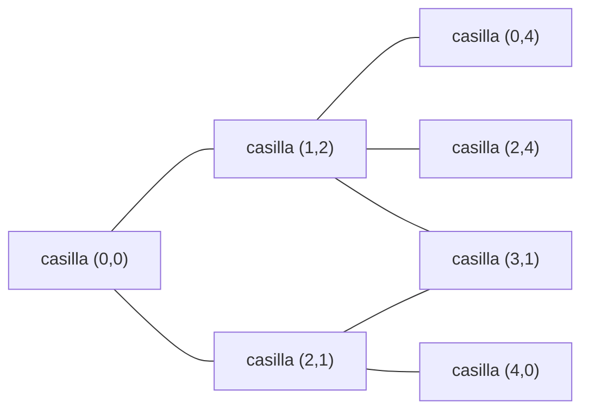

# Knight's Tour Pro — guía técnica

Cómo está construido el programa, qué hace cada algoritmo y por qué, y qué nos dijeron las
mediciones cuando contradijeron lo que esperábamos.

Todas las cifras de este documento salen de ejecutar el propio proyecto. Cuando un dato
viene de la literatura y no lo hemos calculado aquí, se dice explícitamente.

---

## 1. El problema

Un caballo de ajedrez debe visitar **todas** las casillas de un tablero, **exactamente una
vez cada una**, moviéndose siempre en L: dos casillas en una dirección y una en la
perpendicular.

Hay dos variantes:

- **Recorrido abierto**: basta con recorrer todas las casillas.
- **Recorrido cerrado**: además, la última casilla debe quedar a un salto de caballo de la
  primera, de modo que el recorrido se pueda repetir indefinidamente.

Esa diferencia, que parece un detalle, cambia por completo qué algoritmo conviene. Es el
hallazgo central de este proyecto y se desarrolla en la sección 5.

El problema es antiguo: Euler le dedicó un trabajo en 1759, y la heurística que lleva el
nombre de Warnsdorff se publicó en 1823. Sigue siendo un banco de pruebas excelente porque
es fácil de enunciar y su espacio de búsqueda explota enseguida.

---

## 2. El tablero como grafo

La forma productiva de mirarlo es olvidarse del ajedrez.

Cada casilla es un **vértice**. Hay una **arista** entre dos casillas si un caballo puede
saltar de una a otra. Encontrar un recorrido del caballo es entonces encontrar un **camino
hamiltoniano** en ese grafo: un camino que pasa por todos los vértices una sola vez. El
recorrido cerrado es un **ciclo hamiltoniano**.



Esto importa por dos razones.

**La mala**: decidir si un grafo cualquiera tiene camino hamiltoniano es un problema
**NP-completo**. No se conoce ningún algoritmo eficiente para el caso general, y hay
buenas razones para pensar que no existe.

**La buena**: el grafo del caballo no es un grafo cualquiera. Tiene mucha estructura —es
casi regular, muy local, y sus vértices de las esquinas tienen solo dos vecinos—, y esa
estructura es justo lo que explota la heurística de Warnsdorff.

### Grado de cada casilla

El número de saltos posibles desde una casilla es su **grado**. En un tablero 8×8:

```
  2  3  4  4  4  4  3  2
  3  4  6  6  6  6  4  3
  4  6  8  8  8  8  6  4
  4  6  8  8  8  8  6  4
  4  6  8  8  8  8  6  4
  4  6  8  8  8  8  6  4
  3  4  6  6  6  6  4  3
  2  3  4  4  4  4  3  2
```

Las esquinas tienen grado 2: solo se puede entrar y salir. Si el recorrido pasa por una
esquina sin ser el principio ni el final, **consume sus dos aristas**. Esta observación es
la semilla de la heurística de Warnsdorff.

---

## 3. Cuándo existe un recorrido

No todos los tableros tienen solución, y hay teoría que lo predice sin necesidad de buscar.

### El argumento de los colores

Pinta el tablero como uno de ajedrez. **Cada salto de caballo cambia el color de la
casilla**: siempre. Si una casilla es clara, la siguiente será oscura, y así
alternativamente.

De ahí sale una consecuencia inmediata. Un recorrido **cerrado** alterna colores y termina
donde empezó, así que usa exactamente la mitad de casillas de cada color. **Si el tablero
no tiene el mismo número de casillas de cada color, no puede haber recorrido cerrado.**

Y eso pasa siempre que el número de casillas es impar. Comprobado con el propio programa:

```
5x5: 13 claras, 12 oscuras, diferencia 1   -> imposible cerrarlo
6x6: 18 claras, 18 oscuras, diferencia 0   -> no hay obstáculo por aquí
3x4:  6 claras,  6 oscuras, diferencia 0   -> no hay obstáculo por aquí
```

Fíjate en lo que **no** dice el argumento: que el 3×4 tenga los colores equilibrados no
garantiza que exista el recorrido cerrado. Solo descarta una imposibilidad. De hecho el 3×4
no lo tiene, por razones que el argumento de colores no ve.

### El teorema de Schwenk

La respuesta completa para recorridos cerrados la dio Allen Schwenk en 1991. Un tablero
m×n con m ≤ n tiene recorrido cerrado **salvo** en tres familias de excepciones:

1. m y n son **ambos impares**
2. m ∈ {1, 2, 4}
3. m = 3 y n ∈ {4, 6, 8}

La primera es exactamente el argumento de los colores. Las otras dos son más finas y
requieren demostraciones específicas.

Lo verificamos ejecutando el buscador desde **todas** las casillas de cada tablero:

| Tablero | Abierto | Cerrado | Lo que predice la teoría |
| ------- | ------- | ------- | ------------------------ |
| 1×1 | sí | no | excepción 2 (m=1) |
| 2×2 | no | no | excepción 2 (m=2) |
| 3×3 | no | no | excepción 1 (ambos impares) |
| 4×4 | no | no | excepción 2 (m=4) |
| 5×5 | **sí** | no | excepción 1 (ambos impares) |
| 3×4 | sí | no | excepción 3 |
| 3×7 | sí | no | excepción 1 (ambos impares) |
| 3×8 | sí | no | excepción 3 |
| 4×5 | sí | no | excepción 2 (m=4) |
| 5×6 | sí | **sí** | ninguna excepción |
| 6×6 | sí | **sí** | ninguna excepción |

Coincide en los once casos. El 5×5 es el ejemplo bonito: tiene recorridos abiertos de
sobra —**304** solo desde la esquina— pero ni uno solo cerrado, y sabemos por qué.

### Cuántos hay

El número de recorridos crece de forma explosiva. Contados por el programa, partiendo
siempre de la esquina superior izquierda:

| Tablero | Recorridos abiertos |
| ------- | ------------------: |
| 3×4 | 2 |
| 5×5 | 304 |
| 5×6 | 4.542 |

Para el 8×8 completo, la literatura da del orden de 10¹⁶ recorridos abiertos. No lo hemos
calculado aquí, y con la implementación actual sería inviable: cada solución se guarda en
memoria.

---

## 4. Los algoritmos

El proyecto implementa cuatro estrategias tras dos interfaces: `TourSolver` devuelve un
recorrido, y `AllToursSolver` añade `solveAll()` para enumerarlos todos.

### 4.1 Backtracking

La búsqueda en profundidad de toda la vida.

```
resolver(casilla, paso):
    marcar casilla como visitada
    si paso == total de casillas:
        devolver éxito (comprobando el cierre si hace falta)
    para cada salto legal desde casilla:
        si el destino está libre:
            si resolver(destino, paso+1): devolver éxito
    desmarcar casilla        <-- el retroceso
    devolver fracaso
```

Lo único destacable es la última parte: al agotar las opciones, **deshace** la marca y
vuelve atrás. Eso es lo que garantiza que si existe una solución, la encuentra.

**Complejidad.** En el peor caso el árbol de búsqueda tiene factor de ramificación hasta 8
y profundidad igual al número de casillas, lo que da una cota de O(8ⁿ). Es una cota muy
pesimista —el grado real es menor y las casillas visitadas podan mucho— pero el
comportamiento sigue siendo exponencial. Se nota enseguida: nuestro benchmark mide 10,7 ms
para un 6×6 abierto desde el centro, y el mismo algoritmo no termina en horas para un 8×8
cerrado desde una esquina.

**Cuándo usarlo**: cuando hay que garantizar que se encuentra solución si existe, o cuando
hay que enumerarlas todas.

### 4.2 La heurística de Warnsdorff

La idea de 1823, y sigue siendo sorprendentemente buena.

> De todas las casillas a las que puedes saltar, **ve a la que tenga menos salidas
> disponibles**.

La intuición: las casillas con pocas salidas son las que corren peligro de quedarse
aisladas. Si las dejas para el final, llegará un momento en que no puedas alcanzarlas. Al
visitarlas pronto, mientras aún tienen accesos libres, evitas crear callejones sin salida.

Es un algoritmo **voraz**: elige el mejor movimiento local y **nunca retrocede**.

**Complejidad.** Cada paso evalúa como mucho 8 candidatos, y para cada uno cuenta como
mucho 8 vecinos: coste constante por paso. Con n pasos, el coste total es **lineal en el
número de casillas**. Por eso escala a tableros donde el backtracking ni empieza: nuestras
mediciones resuelven un 50×50 —2.500 casillas— en 6 milisegundos.

**Su punto débil**: al no retroceder, si la elección voraz lleva a un callejón, el
algoritmo se rinde y devuelve "no hay solución" aunque sí la haya. No es un fallo de
implementación, es la naturaleza del método.

**El desempate importa.** Cuando varios candidatos empatan a grado mínimo, hay que elegir
uno. Nuestra implementación desempata por el índice del salto en `KnightMove.DX/DY`, lo que
hace el resultado **determinista**: la misma entrada da siempre el mismo recorrido, en
cualquier máquina y cualquier ejecución. Sin eso, los tests no podrían comprobar nada
concreto y los benchmarks medirían ruido.

### 4.3 Enumeración exhaustiva

Es el backtracking sin salida temprana: en lugar de devolver el primer éxito, lo apunta y
sigue buscando. Recorre el árbol entero.

El coste es proporcional al tamaño del árbol de búsqueda, no al número de soluciones, y la
memoria crece con el número de soluciones encontradas, que puede dispararse. Por eso solo
tiene sentido en tableros pequeños.

### 4.4 Búsqueda paralela con Fork/Join

Aquí es donde el proyecto se pone interesante, porque **el paralelismo hace dos cosas
completamente distintas** según el problema.

El mecanismo es el mismo en ambos casos: el marco **Fork/Join** de Java. Una tarea que
encuentra varias ramas puede *bifurcarse* (`fork`) creando subtareas independientes, y
después *unirlas* (`join`) recogiendo sus resultados. El planificador reparte las tareas
entre los hilos disponibles mediante **robo de trabajo** (*work stealing*): un hilo que se
queda sin tareas roba trabajo pendiente de la cola de otro.

El parámetro `forkDepth` controla hasta qué profundidad del árbol se crean tareas. Por
debajo de ese nivel, cada tarea continúa secuencialmente. Es el mando que equilibra
paralelismo contra sobrecarga: bifurcar poco desaprovecha los núcleos, bifurcar demasiado
genera miles de tareas diminutas cuya gestión cuesta más que el trabajo que hacen.

Cada tarea trabaja sobre **su propia copia** de las marcas del tablero. Sin eso, dos hilos
explorando ramas distintas se pisarían las casillas visitadas.

---

## 5. El hallazgo: qué compra realmente el paralelismo

El proyecto venía con un benchmark que comparaba el solver paralelo contra el secuencial y
concluía que el paralelo era espectacularmente más rápido. Al medirlo en serio resultó que
esa conclusión, aun siendo cierta en los números, atribuía el mérito a la causa equivocada.

**El problema metodológico**: el solver paralelo hace dos cosas distintas a la vez. Ordena
los movimientos por el criterio de Warnsdorff **y** bifurca en hilos. Compararlo contra el
backtracking simple mide las dos cosas juntas, y el resultado se le adjudica a la que uno
decida nombrar.

La solución fue añadir una tercera variante que actúa de control: **el mismo solver
paralelo con `forkDepth = 0`**, es decir, con la heurística pero sin hilos. La diferencia
entre esa y el backtracking simple es lo que vale la heurística; la diferencia entre esa y
la versión bifurcada es lo que valen los hilos.

Medido con JMH en una máquina de 12 núcleos, tablero 6×6, tiempo por operación:

| Variante | Abierto, desde el centro | Cerrado, desde la esquina |
| -------- | ------------------------: | ------------------------: |
| Orden ingenuo, un hilo | 10,751 ms | 29,115 ms |
| **Orden Warnsdorff, un hilo** | **0,013 ms** | **6.285 ms** |
| Orden Warnsdorff, paralelo | 0,034 ms | **0,044 ms** |

Hay tres cosas aquí que merecen leerse despacio.

**La heurística vale unas 800× en recorridos abiertos.** De 10,7 ms a 0,013 ms, en un solo
hilo, sin paralelismo de por medio. Esa era la mejora que el benchmark original atribuía a
los hilos.

**La heurística es 216× *peor* en recorridos cerrados.** De 29 ms a 6,3 segundos. Y tiene
sentido: Warnsdorff busca cubrir el tablero, no volver al origen. Lleva la búsqueda a una
región enorme de caminos que pasan por las 36 casillas y **no cierran**, y un solo hilo
tiene que salir de ahí retrocediendo callejón a callejón.

**En el caso abierto, bifurcar empeora las cosas 2,6×.** No queda búsqueda que repartir: lo
único que aportan los hilos es el coste de copiar tableros y gestionar tareas.

### Los 143.000× que no son lo que parecen

En el caso cerrado, bifurcar convierte 6,3 segundos en 0,044 milisegundos. Son unas
**143.000 veces más rápido con 12 núcleos**.

Ese número es imposible por reparto de trabajo. Doce hilos no pueden dar más de 12×. Si
sale 143.000×, es que está pasando otra cosa.

Y así es. La ganancia no viene de dividir el trabajo, sino de **no tener que fiarse de la
heurística**. Con `forkDepth = 4` el solver explora muchas ramas de apertura a la vez. La
rama que Warnsdorff coloca en primer lugar es la trampa; alguna otra cierra el recorrido en
microsegundos. Y en cuanto una lo consigue, una bandera compartida detiene a todas las
demás.

Dicho de otro modo: aquí **el paralelismo compra diversificación, no rendimiento**. Es un
seguro contra una heurística que en este caso apunta en la dirección equivocada.

Eso explica también algo que parecía contradictorio: el solver paralelo gana al backtracking
simple en recorridos cerrados (29 ms → 0,044 ms) **a pesar de tener la peor ordenación de
las dos**. Ejecutar muchas ordenaciones a la vez bate a comprometerse con cualquiera.

### Enumeración: aquí el paralelismo sí es lo que parece

Enumerar todos los recorridos es el caso opuesto, y por eso vale la pena tenerlo.

No hay salida temprana: hay que recorrer el árbol completo pase lo que pase. Los hilos
reparten una cantidad fija de trabajo, y la ganancia queda acotada por el número de
núcleos, como dicta la intuición.

| Estrategia | 5×6 abierto, 4.542 recorridos |
| ---------- | ----------------------------: |
| Secuencial | 2.513 ± 344 ms |
| Paralela, `forkDepth` 3 | 707 ± 287 ms |

Unas **3,5× con 12 núcleos**. Los márgenes de error son amplios, así que la lectura honesta
es "varias veces más rápido", no una cifra exacta.

**¿Por qué no 12×?** Por dos razones concretas. Las ramas están muy desequilibradas: unas
aperturas llevan a muchos más recorridos que otras, así que unos hilos terminan pronto y
esperan. Y cada tarea bifurcada copia las marcas del tablero, un coste que el secuencial no
paga.

---

## 6. Cómo está construido el programa

### Estructura

```
src/main/java/knights/
├── model/      Board, Position, KnightMove
├── solver/     las cuatro estrategias, tras dos interfaces
├── export/     TXT, JSON, SVG, CSV
├── ui/         interfaz JavaFX
└── Main.java   línea de comandos
```

Dos interfaces mantienen las estrategias intercambiables. `TourSolver` devuelve un
recorrido o una lista vacía; `AllToursSolver` añade `solveAll()`. Los exportadores viven
tras `ResultExporter`, así que añadir un formato es añadir una clase.

### La tabla de vecinos precalculada

El cambio de rendimiento más rentable del proyecto, y no tocó ningún algoritmo.

`Board.legalMoves()` construía la lista de saltos legales **en cada llamada**: creaba dos
flujos y ocho objetos `Position`. Y se invoca una vez por nodo del árbol de búsqueda, más
otra vez por cada candidato al calcular los grados de Warnsdorff — unas nueve veces por
nodo.

Ahora se calculan una sola vez por tamaño de tablero y la tabla se comparte entre todas las
copias. Eso último importa especialmente: el solver paralelo copia un tablero por cada rama
que explora, y recalcular la tabla en cada copia habría sido carísimo. Como la tabla es
inmutable, compartirla entre hilos es seguro.

**Resultado medido: entre 2,7× y 7× más rápido** en todas las variantes del benchmark, sin
cambiar ni una solución.

### Cancelación cooperativa

Un hilo no se puede matar a mitad de una búsqueda sin dejar el tablero a medio marcar. Así
que los solvers **consultan** si alguien les ha pedido parar, cada 4.096 casillas
exploradas. El intervalo no es arbitrario: mirar en cada casilla sí se notaría en el
rendimiento, y a este ritmo la reacción sigue siendo instantánea para una persona.

Quien quiere detener una búsqueda interrumpe el hilo, y el solver lanza
`CancellationException` dejando la marca de interrupción puesta para quien esté más arriba.

El solver paralelo necesita algo más: interrumpir el hilo que llama **no alcanza** a los
hilos del pool. La cancelación les llega por una bandera compartida, igual que les llega el
aviso de que alguien ya encontró solución.

Medido: **sin coste apreciable** en el rendimiento.

### Formatos de salida

| Formato | Para qué |
| ------- | -------- |
| TXT | leerlo de un vistazo |
| JSON | procesarlo desde otro programa |
| SVG | verlo dibujado; el trazo degrada de índigo a cian según avanza |
| CSV | cargarlo en una hoja de cálculo; una fila por movimiento |

### Una carpeta por ejecución

Los cuatro exportadores abrían el fichero con `TRUNCATE_EXISTING`, que vacía lo que hubiera
antes. Como los nombres eran fijos —`tour.txt`, `tour.json`…—, ejecutar el programa dos
veces contra la misma carpeta **borraba el primer resultado sin avisar**.

Ahora cada ejecución escribe en su propia carpeta, nombrada con la fecha y hora de inicio:

```text
output/
├── 2026-09-18_234327/     tour.txt  tour.json  tour.svg  tour.csv
├── 2026-09-18_234327_2/
└── 2026-09-19_101502/
```

**Por qué una carpeta y no un sufijo en el nombre.** Con cuatro formatos por ejecución, la
alternativa —`tour-2.txt`, `tour-2.json`, `tour-3.txt`…— deja los ficheros de varias
ejecuciones entremezclados en el mismo directorio. La carpeta mantiene junto lo que va
junto. Y el formato `yyyy-MM-dd_HHmmss` hace que ordenar por nombre sea ordenar por fecha,
que es la razón de poner el año primero.

#### El problema de comprobar y luego actuar

La marca de tiempo solo llega al segundo, así que dos ejecuciones seguidas chocan con
facilidad. No es un caso raro de laboratorio: al probarlo, **tres ejecuciones consecutivas
cayeron en el mismo segundo**.

La forma natural de resolverlo es la que no funciona:

```java
// MAL: entre la comprobación y la creación cabe otro proceso
if (!Files.exists(candidata)) {
    Files.createDirectory(candidata);   // ...y aquí ya puede existir
}
```

Es el patrón **TOCTOU** (*time of check to time of use*, "del momento de comprobar al de
usar"): entre que preguntas si algo está libre y lo reservas, hay una ventana en la que
otro puede habérselo llevado. En un fichero de resultados el fallo es silencioso: dos
ejecuciones creen tener la carpeta y una machaca a la otra.

La solución es no separar las dos operaciones:

```java
try {
    return Files.createDirectory(candidata);   // falla si el nombre está ocupado
} catch (FileAlreadyExistsException ocupado) {
    // probar el siguiente nombre
}
```

`Files.createDirectory` **crea la carpeta o falla**, en un solo paso indivisible que
resuelve el sistema de ficheros. No hay ventana. Si falla, se prueba `_2`, `_3`, y así
sucesivamente. El principio general es el que conviene recordar: **cuando algo tenga que
ser exclusivo, pide la operación atómica que ya existe en vez de componerla tú a base de
comprobaciones**.

Es el mismo razonamiento que aparece en `compareAndSet` sobre la bandera compartida de los
solvers paralelos: comprobar y escribir en una sola operación en lugar de leer, decidir y
escribir por separado.

**Cómo se comprobó**: un test lanza 16 peticiones simultáneas desde 8 hilos, todas con la
misma marca de tiempo, y verifica que salen 16 carpetas distintas. Otro deja un resultado
anterior en una carpeta con ese nombre exacto y comprueba que la nueva ejecución ni lo
toca ni lo reutiliza.

**Un efecto secundario agradable**: al ser la carpeta siempre nueva y vacía, desapareció
toda una clase de fallos de escritura. Uno de los tests existentes provocaba un error
poniendo un directorio donde debía ir `tour.txt`; con este cambio esa situación ya no puede
darse, y el test se sustituyó por el que comprueba que dos ejecuciones conviven.

### Códigos de salida

La línea de comandos distingue cuatro finales, para que un script pueda actuar en
consecuencia:

| Código | Significado |
| ------ | ----------- |
| 0 | Se encontró un recorrido |
| 1 | No existe ninguno para esa configuración |
| 2 | Los argumentos no son válidos |
| 3 | No se pudo escribir un fichero |

La decisión que merece explicación: **"no hay recorrido" no es un error**. Un 4×4 no tiene
solución, y el programa ha hecho su trabajo perfectamente al decirlo. Es la misma convención
que usa `grep`.

---

## 7. Cómo se verificó

Con 120 tests, pero el número importa menos que lo que comprueban.

**Geometría, no soluciones concretas.** Los tests de los solvers no comparan contra un
recorrido guardado: verifican que el resultado *es* un recorrido —longitud correcta, sin
repeticiones, saltos legales, cierre cuando toca—. Así siguen valiendo aunque un cambio
altere qué solución se encuentra primero.

**Equivalencia exacta cuando hace falta.** Hay dos cambios donde eso no bastaba, porque
debían producir *exactamente* lo mismo que antes:

- La tabla de vecinos: comparamos 377 líneas de salida contra la implementación anterior,
  incluidas las 304 soluciones del 5×5 en su orden exacto. Idénticas.
- La enumeración paralela: misma comprobación sobre siete configuraciones —cuadradas,
  rectangulares en ambos sentidos, cerradas, sin solución— y los cuatro valores de
  `forkDepth`. Huella idéntica en todas.

**Romper el código a propósito.** Un test que pasa a la primera no demuestra que detecte
nada. Introdujimos los fallos que cada grupo de tests debería cazar y comprobamos que
fallan. El resultado más instructivo: al alterar el orden de los saltos del caballo, los
**nueve tests de solvers pasan tan tranquilos** —los recorridos siguen siendo válidos, solo
que distintos— y solo lo detectan los tests del modelo. Era exactamente el hueco que había
abierto la tabla de vecinos.

**Contrastar contra el mundo real.** El CSV no se validó solo por su forma: generamos las
304 soluciones del 5×5, releímos el fichero con un lector de CSV y comprobamos que cada
solución reconstruida sigue siendo un recorrido de caballo válido. El SVG se valida
parseándolo como XML y verificando que **cada segmento dibujado une dos casillas separadas
por un salto de caballo legal**.

---

## 8. Qué nos llevamos

**Medir lo que se cree saber.** El informe de rendimiento original describía dos clases que
no existían en el repositorio y atribuía la mejora a la causa equivocada. Nadie lo había
notado porque los números eran ciertos; lo falso era la explicación.

**Separar las variables.** El error de fondo era comparar dos cosas que diferían en dos
aspectos a la vez. La variante de control —el solver paralelo sin paralelismo— fue lo que
hizo visible el reparto real del mérito.

**Un speedup imposible es una pista.** 143.000× con 12 núcleos no podía ser reparto de
trabajo. Perseguir esa contradicción es lo que reveló el mecanismo verdadero.

**La misma técnica no siempre hace lo mismo.** El paralelismo es diversificación cuando
buscas un resultado y hay salida temprana, y reparto de trabajo cuando los tienes que
encontrar todos. Mismo código, ganancias de naturaleza distinta.

**Comprobar y luego actuar no es lo mismo que actuar.** Preguntar si un nombre está libre y
después reservarlo deja una ventana entre ambas cosas. Cuando el sistema ofrece una
operación que hace las dos a la vez —crear la carpeta o fallar—, esa es la que hay que
usar.

---

## Referencias

- El [informe de benchmarks](Knights%20Tour%20Pro%20-%20Benchmark%20Report%20%28JMH%29.md)
  tiene la metodología completa, los márgenes de error y cómo reproducir las mediciones.
- El [README](../README.md) explica cómo ejecutar el programa y elegir estrategia.
- A. J. Schwenk, *Which Rectangular Chessboards Have a Knight's Tour?*, Mathematics
  Magazine, 1991 — el teorema de la sección 3.
